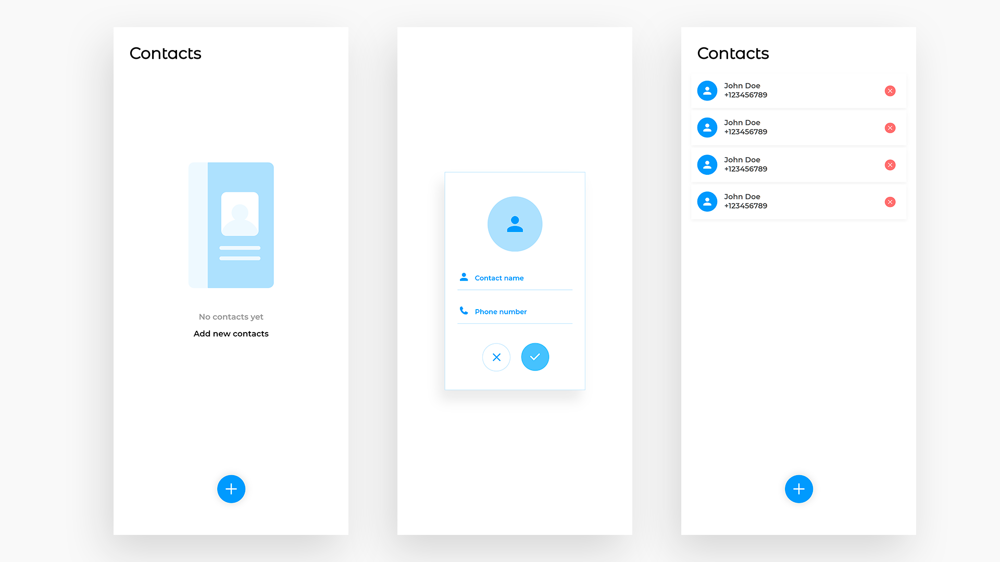

# Vue Contacts App
## [See live preview here](https://suhejlhadzi.github.io/contacts-app/)



A simple Contacts App Created with Vue. 

## Getting Started

These instructions will get you a copy of the project up and running on your local machine for development, testing and learning purposes. See deployment for notes on how to deploy the project on a live system.

### Installing

Clone the Repository and run

```
npm install
npm run dev
```

## Deployment

To deploy simply run

```
npm run build
```

## Built With

- [Vue](https://vuejs.org/)

## Contributing

Please feel free to send pull request if you want to contribute! 

## Authors

- **SuhejlHadzi** - _Development_ - [SuhejlHadzi](https://github.com/SuhejlHadzi)
